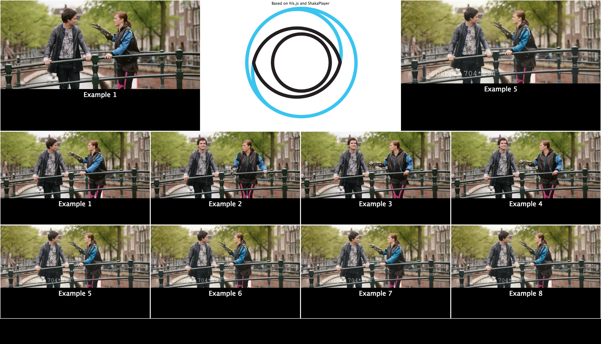

This is a web based multiview screen for HLS and MPEG-DASH streams based on hls.js and Shaka Player. Recommended to run in fullscreen mode.



Demo: http://labs.eyevinn.se/multiview/?config=example.json

Some limitations apply:

- No support for DRM protected content as this is often solutions specific to each site
- Only tested in Chrome and Safari

# Installation

Get the code from Github or fork the repository if you plan to contribute to this project.

`git clone https://github.com/Eyevinn/ott-multiview.git`
		
Install the necessary node modules:

> npm install
		
Start the Node express app:

> npm start

# ENV vars

To start a listener on a port other than 3000, set/export the `PORT` ENV var.
To start a HTTPs server, export:
```
SSL_KEY=/path/to/key
SSL_CRT=/path/to/cert
SSL_CA=/path/to/CA/cert
```

If you wish to auto redirect from HTTP (TCP 80) to HTTPs, set/export:
```
REDIRECT_HTTP=true
```
**Note that you can only start a listener on TCP 80 and 443 as a super user since these are well known port.**

# Usage

When the Node express app is up and running you can direct your Chrome browser to:

> http://localhost:3000/?config=example.json`
		
where `example.json` is a configuration file placed in the directory `config/` and can look like this:
```json
{
	"row0": [
		{ "title": "View port title",
		  "manifest": "http://example.com/master.m3u8",
		  "type": "hls" }
	],
	"row1": [
		{ "title": "View port title 2",
		  "manifest": "http://example.com/manifest.mpd",
		  "type": "dash" }
	]
}
```

If a row doesn't have 4 sources, you may opt to add a placeholder video to be displayed.
For example, adding:
```
  "placeholder": [
    { "title": "NO SIGNAL",
      "manifest": "path/to/placeholder/videostream.mpd",
      "type": "dash"
    }
 ]
```
Will play path/to/placeholder/videostream.mpd in the extra divs.
If no `placeholder` is defined, these divs' `display` attribute will be set to `none`, effectively hiding them.

To toggle audio on or off click on the viewport that you want to listen to. A green border indicates for which viewport the audio is enabled. You can also use the keyboard keys 1-8.

## Keyboard Shortcuts
- SPACE - toggle play / pause for all viewports
- 1-8 - activate audio for viewport 1 to 8
- F - toggle fullscreen mode
		
# Contribution

We are very happy if you want to contribute to this project. Just follow the "normal" procedures and:

1. Fork this repository
2. Create a topic branch in your fork
3. Add feature or fix bug in the topic branch
4. Issue a pull request explaining what has been done

# About Eyevinn Technology

Eyevinn Technology is an independent consultant firm specialized in video and streaming. Independent in a way that we are not commercially tied to any platform or technology vendor.

At Eyevinn, every software developer consultant has a dedicated budget reserved for open source development and contribution to the open source community. This give us room for innovation, team building and personal competence development. And also gives us as a company a way to contribute back to the open source community. 

Want to know more about Eyevinn and how it is to work here. Contact us at work@eyevinn.se!
